# Ontologías y Multilingualidad

---

## Contenido

- Multilingualidad: definición y finalidad
- Localización vs. Internacionalización
- De los sistemas monolingües a los sistemas multilingües
- Sistemas de PLN con multilingualidad
- La multilingualidad en los SBC
- La multilingualidad en las ontologías
  - Información
  - Realización
  - Modelización

---

## Multilingualidad: ¿Para qué?

**Necesidad de multilingualidad en los sistemas de PLN:**

- Sistemas de búsqueda de respuestas
- Búsqueda de información multilingüe
- Recuperación de información
- Traducción automática

**Objetivos principales:**

- Compartición de conocimientos → ontologías
- Reutilización de conocimientos
- Ontologías → Web semántica

---

## ¿Cómo conseguir la multilingualidad? Localización vs. Internacionalización

### Localización

> *Localization involves taking a product and making it linguistically and culturally appropriate to the target locale (country/region and language) where it will be used and sold (LISA)*

- **En economía:** adaptar un producto a un entorno distinto del original (*a non-native environment*)
- **En software y diseño web:** adaptar el contenido, la lengua y el diseño a la cultura y la lengua de llegada
- **En ontologías:** *Ontology Localization* involucra el proceso de adaptar una ontología a un lenguaje y cultura en particular

---

## Internacionalización

> *Internationalization is the process of generalizing a product so that it can handle multiple languages and cultural conventions without the need for re-design. Internationalization takes place at the level of program design and document development (LISA).*

**Es importante:**

- **Separar el texto del código fuente** → evita que los traductores cambien el código fuente
- **No se limita al software:** *online help*, *documentation* y *web sites* pasan por este proceso
- **Para los escritores técnicos:** *"writing for a global audience"*, *"web site globalization"*

---

## De la localización de SW a la localización de ontologías

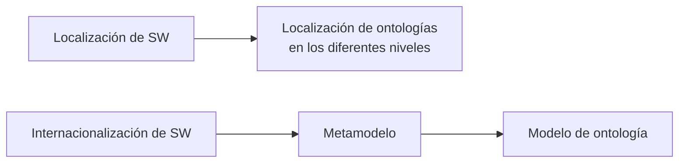

---

## Semejanzas entre ambos procesos

### Internacionalización

- **Contenido léxico:** caracteres y símbolos que maneja el ordenador (ASCII encoding, UNICODE, etc.)
- **Contenido gramatical:** caracteres, estructuras sintácticas y símbolos utilizados en determinados lenguajes de ontologías (RDF(S), OWL)
- **Paradigma de representación del conocimiento:** marcos, redes semánticas, LD, (ontologías)

### Localización

- **Contenido léxico-terminológico:** términos o palabras que sirven para denominar los elementos de la ontología
- **Contenido conceptual:** decisiones de conceptualización como la granularidad, expresividad, perspectiva, etc. Especialmente en ontologías de dominio.
- **Contenido pragmático:** resultado final del modelo (GUI, etc.)

---

## Multilingualidad en los SBC

La multilingualidad puede darse en tres niveles:

1. **Interfaz**
   - a) Mensajes
   - b) Contenido
2. **Datos**
3. **Representación de conocimiento**

---

## 1. Interfaz: (a) Visualización de mensajes

| Tipo | Descripción |
|------|-------------|
| **Monolingüe** | Una sola lengua en la interfaz (`Name` / `Search`) |
| **Multilingüe simultáneo** | Varias lenguas mostradas al mismo tiempo (`Name/Nombre` / `Search/Buscar`) |
| **Multilingüe no simultáneo** | Selección de lengua mediante bandera u opción; la interfaz cambia según la selección |

### Ventajas y desventajas

- **Visualización simultánea:** la incorporación de otras lenguas **requiere modificar el código de visualización**.
- **Visualización no simultánea:** no implica modificar todo el código, sino **ampliar el nº de interfaces** y modificar las opciones de selección.

---

## 1. (b) Visualización del contenido de forma multilingüe

### Cuando la BC es multilingüe

1. La aplicación consulta a la BC
2. La interfaz muestra el contenido en el idioma seleccionado

### Cuando la BC es monolingüe

1. La aplicación consulta a la BC
2. Se utiliza un sistema de traducción (recurso multilingüe)
3. La interfaz muestra la traducción

> Interfaz similar en ambos casos, **PERO** el tiempo de respuesta varía si la BC es multilingüe.

### Ventajas y desventajas

| | BC Multilingüe | BC Monolingüe |
|---|---|---|
| **Tiempo de obtención** | = TR de la BC | = TR de BC + TR del recurso multilingüe |
| **Razón** | Multilingualidad conferida en tiempo de diseño | La traducción se realiza en tiempo de ejecución |
| **Desambiguación** | En tiempo de diseño | Puede alargar el TR |

---

## Multilingualidad en los datos de los SBC

La información sobre los individuos es multilingüe. La multilingualidad se tratará como **otro carácter más del dominio** que se va a modelar.

> *Ejemplo: Datos multilingües en una RC monolingüe que considera la característica `Language`*

### Representación del conocimiento

- **Datos:** instancias o individuos, nivel inferior de la RC (Mickey, Minnie, Pluto, Madroño…)
- **Modelo:** nivel intermedio; representa la estructura de los datos (Ontología de Animales de ficción, Ontología de Animales Reales…)
- **Metamodelo:** nivel superior; representa la estructura del modelo (Ontología compuesta de conceptos, relaciones…)
- **Mapping:** relación entre elementos de conjuntos diferentes: dos ontologías, una ontología y una BD, etc.

---

## Multilingualidad en Representación del conocimiento: Ontologías

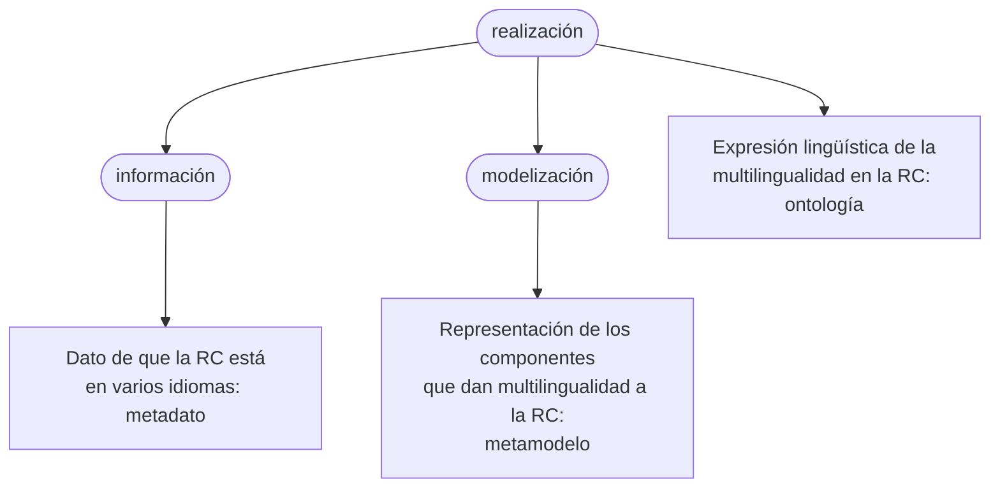

---

## La multilingualidad en las ontologías — 1. Información

Estándar de referencia: **OMV** (Ontology Metadata Vocabulary)

### Opción 1: Multilingualidad mediante relación

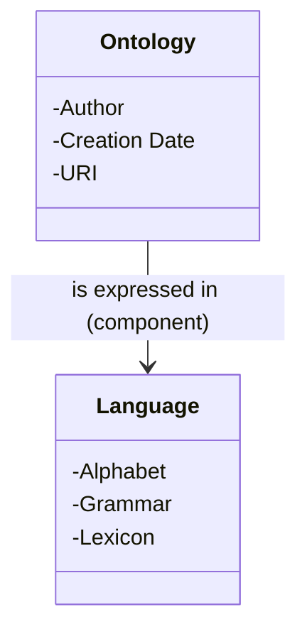

### Opción 2: Multilingualidad modificando los metadatos del concepto

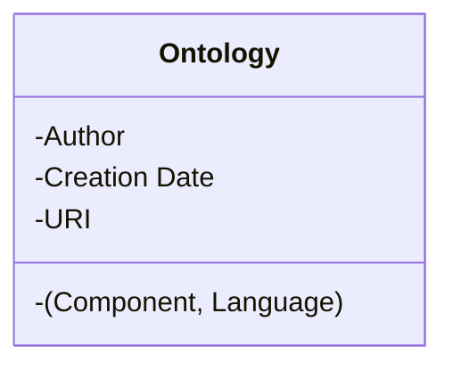

### Ventajas y desventajas

| | Opción 1 | Opción 2 |
|---|---|---|
| **Ventaja** | Riqueza de información lingüística | Más sencilla y fácil de implementar |
| **Desventaja** | Dificultad de instanciar el concepto *language* con toda la información; pocos sistemas tienen relaciones con información semántica asociada | Se pierde información lingüística |

---

## La multilingualidad en las ontologías — 2. Realización

Estrechamente ligada a modelización. La **realización** es la instanciación del modelo.

Pueden darse dos opciones:

- **Información lingüística dentro de la ontología**
- **Información lingüística fuera de la ontología:**
  - BD relacional
  - Base terminológica
  - Lexicón multilingüe
  - Tesauro multilingüe

---

### 2. Realización — Información lingüística dentro de la ontología (1)

> Multilingualidad en la ontología: **conceptos, no atributos**

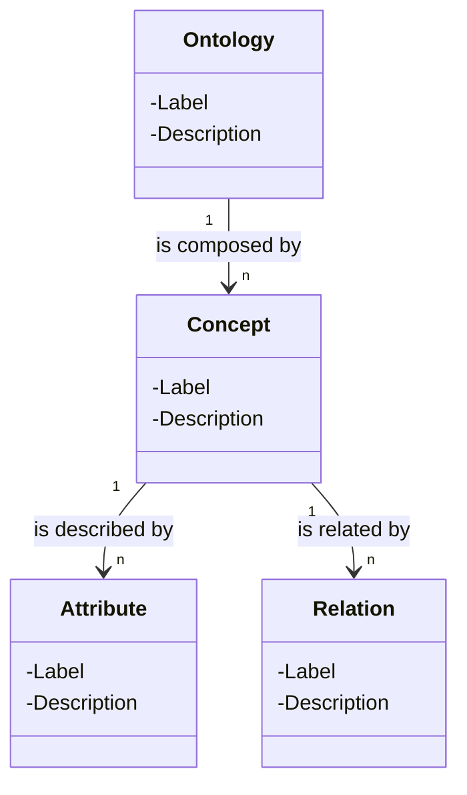

**Ejemplo en la ontología (etiquetas multilingües solo en conceptos):**

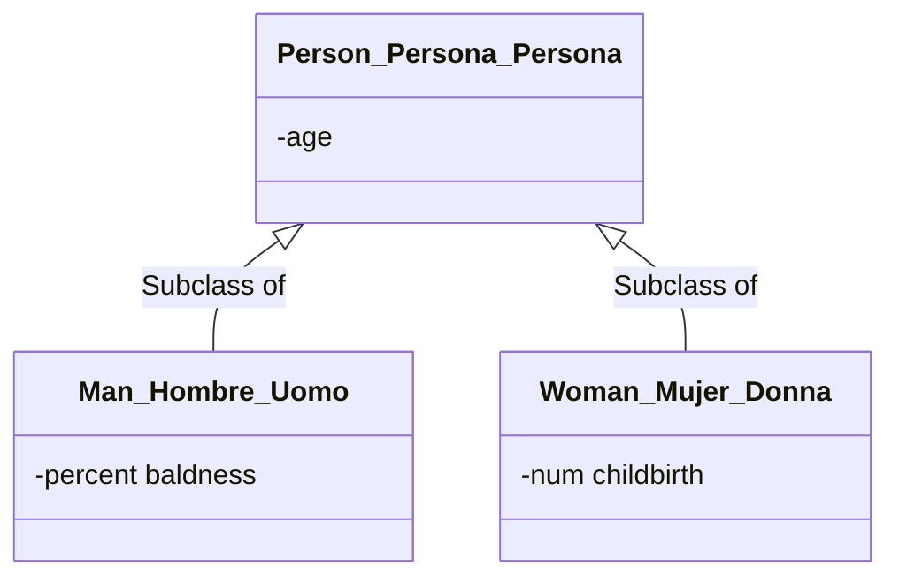

---

### 2. Realización — Información lingüística dentro de la ontología (2)

> Mismo metamodelo de ontología — **Multilingualidad en atributos**

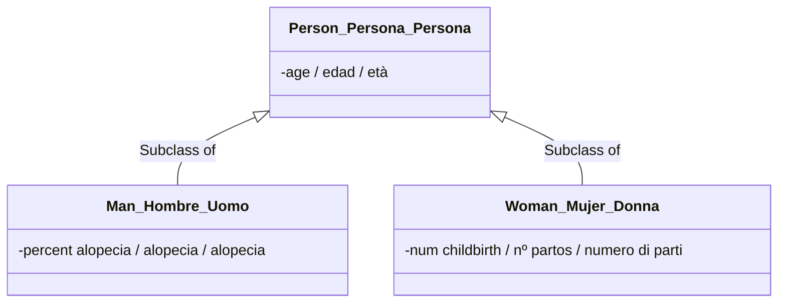

---

### 2. Realización — Información lingüística fuera de la ontología (1)

> Metamodelo de multilingualidad con metamodelo de ontología **"alingüe"** y modelo de recurso lingüístico → **Genoma KB**

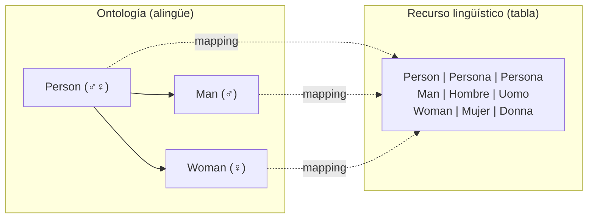

---

## La multilingualidad en las ontologías — 3. Modelización

Tres opciones:

- **A.** Ampliar el metamodelo de ontologías con información lingüística
- **B.** Agregar un modelo de información lingüística y relacionarlo con el metamodelo de ontologías
- **C.** Utilizar *mappings* para relacionar ontologías monolingües

---

### A. Ampliación del metamodelo con información lingüística

Multilingualidad en conceptos mediante propiedades para definir etiquetas y descripciones:
`Rdfs:label`, `Rdfs:comment` → **Localización a nivel terminológico**

> *Se limita la información lingüística a un dato*

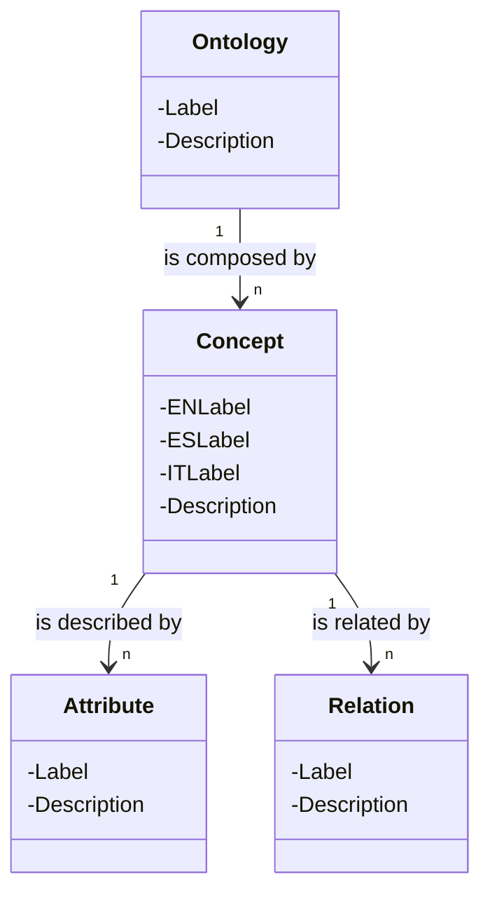

#### Ventajas y desventajas

| | |
|---|---|
| **Ventaja** | La ampliación a otras lenguas es fácil; adecuado para dominios muy especializados con conocimiento compartido por comunidades lingüísticas de usuarios |
| **Desventaja** | Información lingüística limitada a etiquetas para las clases; se asume una total sinonimia aunque no sea cierta |

---

### B. Metamodelo de ontología y modelo mapping

Varía dependiendo de la **aridad** en los *mappings* y de la **forma del grafo**. Dos posibilidades:

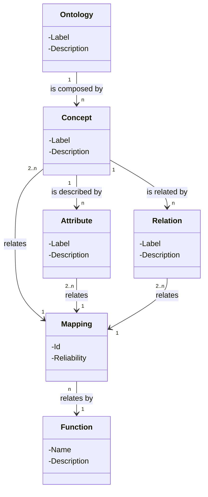

#### B1: Mappings binarios en grafo ortogonal

→ Localización a nivel conceptual; menos intuitivo desde el punto de vista de abstracción

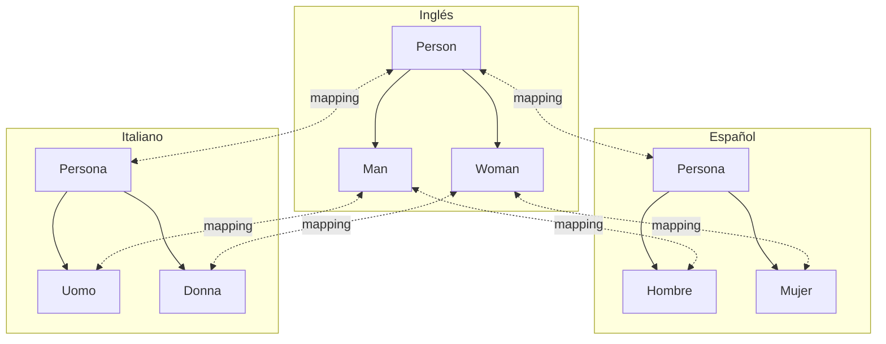

#### B2: Mappings binarios en grafo radial

→ Localización a nivel conceptual; los *mappings* se realizan a través de un modelo **"interlingüe"** (EWN)

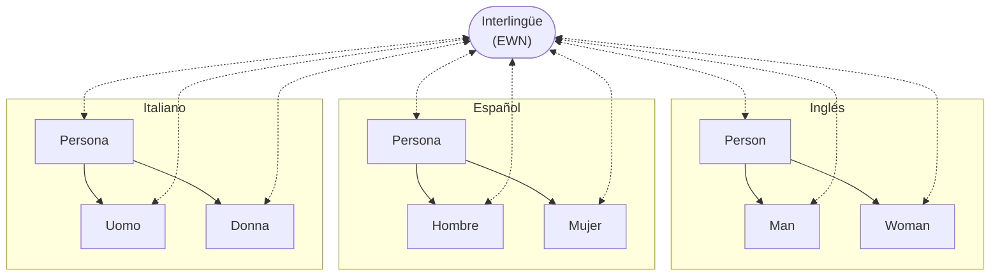

#### Ventajas y desventajas

| | |
|---|---|
| **Ventaja** | Se mantienen las conceptualizaciones en cada lengua; adecuado para dominios muy dependientes de la lengua (ámbito judicial) |
| **Desventaja** | Se requiere mucho esfuerzo para modelizar el mismo dominio en lenguas distintas; se requiere dominio lingüístico, del campo de conocimiento y ontológico |

---

### C. Modelo de información lingüística relacionado con el metamodelo de ontologías

- Localización al nivel **terminológico y conceptual**
- Los elementos de la ontología se enlazan con los datos multilingües almacenados **fuera** de la ontología
- Diferentes formas de organizar y representar la información lingüística: BD (GenomaKB, Oncoterm), una ontología, etc.
- La conceptualización permite modificaciones para satisfacer las necesidades de localización: **creación de módulos**

**Metamodelo de multilingualidad para etiquetas de conceptos:**

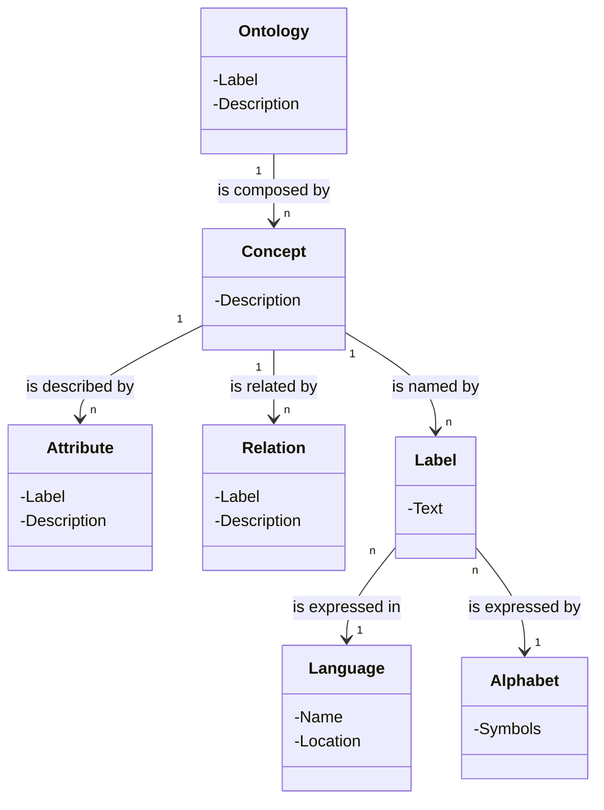

> Aumenta las posibilidades de incluir información sobre la lengua y los componentes de las ontologías.

#### Ventajas y desventajas

| | |
|---|---|
| **Ventaja** | Se puede incluir toda la información lingüística que se desee; se enlazan los elementos lingüísticos dentro de una lengua y entre varias lenguas; las diferencias y especificidades se pueden formalizar al nivel terminológico; se preserva información relevante (fuentes, etc.); no es necesario el conocimiento del experto en ontologías para acceder al nivel terminológico en un entorno distribuido |
| **Desventaja** | Se pueden perder especificidades propias de una lengua, salvo que se reflejen en los módulos de la ontología específicos de la lengua |
